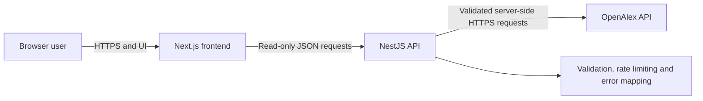

# Exam Report — Introduction to Web Development

## Submission metadata

- **Title:** ResearchTrail — Academic Discovery and Trend Exploration
- **Student ID number:** 24131621
- **Deployment URL:** ******
- **Estimated total development time:** 160-180 hours
- **GitLab repository URL (optional):** git@gitlab.gwdg.de:m.abbas/researchtrail.git

## Submission checklist

- [x] Metadata above completed by the student.
- [x] Privacy information integrated at `/privacy` and linked globally.
- [x] Accessibility statement integrated at `/accessibility` and linked globally.
- [x] [University of Göttingen legal notice](https://www.uni-goettingen.de/de/439238.html) linked globally and from both statements.
- [x] `README.md` documents system dependencies, dependency installation, configuration, development, build and production-run instructions.
- [ ] Source submission completed: grant `lorenz.glissmann@uni-goettingen.de` access to the repository stated above, or attach a `.zip` file.
- [ ] Operator, contact, hosting and retention placeholders completed before public deployment.

## Abstract

ResearchTrail is a full-stack web application for students, researchers and other readers who need to discover and understand scholarly literature. It uses OpenAlex metadata to support keyword search, filtering, publication inspection, topic-trend analysis and bounded citation exploration. A user can move from a broad query to individual works, follow related publications and references, or compare publication and citation activity over a chosen period. The application is intentionally stateless: it does not create user profiles, retain searches or store publication data. This design keeps the workflow immediate, reduces operational complexity and limits personal-data processing while still demonstrating a complete browser–API–external-service architecture. The project prioritises clear data normalisation, responsive and accessible interaction, honest descriptions of visualisation limits and robust handling of upstream failures. ResearchTrail is suitable as an educational demonstrator; public operation still requires the controller, hosting and retention details identified in the integrated privacy information.

## Overview of the range of functions

- Search OpenAlex works by title, topic, author terms or DOI-like input.
- Filter by publication year and open-access status; sort by relevance, date or citation count.
- Browse paginated, normalised publication results with explicit loading, error and empty states.
- Inspect metadata, reconstructed abstracts, authors, topics, source links and related works.
- Explore a bounded citation/reference graph with a keyboard-accessible publication list alternative.
- Analyse topic publication growth, citation activity, influential authors, related topics and highly cited works.
- Access integrated privacy and accessibility statements and the university legal notice from every view.

## Architecture

### Software stack

| Layer | Technology | Responsibility |
| --- | --- | --- |
| Browser UI | Next.js 16 App Router, React 19, TypeScript, Tailwind CSS 4 | Views, navigation, forms, visualisation and server-state rendering |
| Client data | TanStack Query | Loading/error state, request caching and refetch control |
| Graph | Cytoscape.js | Interactive citation graph rendering |
| HTTP API | NestJS 12, TypeScript, class-validator, Helmet, express-rate-limit | Routes, validation, security headers, rate limiting and orchestration |
| External data | OpenAlex REST API | Scholarly works, topics, authors, citations and references |

### System structure

The application is a stateless client–server system. Next.js owns presentation and browser interaction. NestJS is the controlled boundary for input validation, request limits and external-data access. `OpenAlexService` is an adapter that hides OpenAlex response shapes and gives the rest of the application stable, normalised domain objects. There is no application persistence layer.

### Project-wide decisions

1. **OpenAlex access is backend-only.** The API key stays outside browser bundles, timeouts and upstream errors are translated once, and the UI consumes one stable model.
2. **The application is stateless.** Removing profile and persistence features reduces collected data, dependencies, security surface and deployment requirements.
3. **The citation graph is bounded.** Eight references and eight citing works make response time and visual complexity predictable. It is an exploration aid, not a complete bibliometric graph.
4. **Server state is distinct from view state.** TanStack Query manages remote loading and caching; local React state manages form drafts and visual interactions.
5. **Styling uses two levels.** Base and reusable component rules live in separate CSS files; page composition uses colocated Tailwind utilities.
6. **Scope is deliberately constrained.** Recommendations, PDF analysis, collaboration and background jobs were excluded so the implemented workflow remains maintainable within a semester project.

The stack is suitable because TypeScript spans both applications, NestJS offers clear module boundaries and validation, and Next.js/React support the dynamic filters and graphs required by the idea. Stateless operation simplifies deployment and privacy responsibilities. The trade-off is dependence on OpenAlex availability and two deployed processes instead of a single monolith.

## Frontend

### Structure and responsibilities

- `app/`: route-level views, metadata and layouts.
- `components/`: shared header, footer, query provider, result card and visualisation components.
- `lib/`: HTTP client and shared frontend response types.
- `styles/base.css`: document defaults, keyboard focus and reduced-motion behaviour.
- `styles/components.css`: reusable buttons, inputs, cards, panels, navigation and legal-document typography.

The frontend builds query parameters, enforces basic form constraints, renders asynchronous states, caches remote reads and visualises normalised API responses. It stores no user identity or research records. The API repeats all authoritative validation.

### Views and interaction options

| View | Main interactions |
| --- | --- |
| Discovery `/` | Search, set year/open-access filters, sort, paginate and open a result |
| Trends `/trends` | Search topics, choose preset/custom ranges, switch charts and pivot to a related topic |
| Publication `/works/:id` | Read metadata/abstract, follow source/PDF links, open the graph or a related work |
| Citation explorer `/graph/:id` | Select graph nodes or use the keyboard-accessible publication list |
| Privacy/accessibility | Read the notices and follow the university legal notice |

Next.js generates HTML through React Server and Client Components. Interactive, data-heavy views are Client Components because they require query state and browser events. Tailwind utilities plus the separate CSS layers provide responsive styling without a runtime CSS-in-JS dependency.

### Frontend challenges

- Dense scholarly metadata must remain scannable on small screens and at browser zoom.
- Citation and trend visualisations need meaningful non-pointer and non-visual alternatives.
- Topic autocomplete needs separate draft and committed state to avoid rebuilding the full dashboard on every keystroke.
- Upstream loading, empty and failure states must be clear without interrupting navigation.

## Backend

### Structure and responsibilities

- `WorksModule`: discovery, publication detail, related-work and graph endpoints.
- `TrendsModule`: topic lookup and trend analytics endpoints.
- `OpenAlexModule`: external HTTP adapter, normalisation, timeout handling and error translation.

Global request validation rejects unexpected fields and converts supported query primitives. Per-client throttling enforces a 10-request/second burst limit and a 60-request/minute sustained limit; graph and full trend analysis are additionally capped at 10 requests/minute. CORS is restricted to the configured frontend origin in production. Helmet, no-store caching and a simple query parser reduce the HTTP attack surface. Every route is read-only from the application’s perspective.

### Communication interfaces and APIs

All endpoints return JSON below the `/api` prefix. `400` denotes invalid input, `404` a missing external resource and `502` an OpenAlex failure.

| Method | Route | Purpose |
| --- | --- | --- |
| GET | `/search` | Search works with filters, sorting and pagination |
| GET | `/works/:id` | Return one normalised work and up to six related works |
| GET | `/works/:id/graph` | Return the centre work, up to eight references and eight citing works |
| GET | `/trends` | Return topic metrics for a supplied date range |
| GET | `/trends/topics` | Return topic autocomplete results |
| GET | `/trends/topic/:id` | Return one normalised topic |

The external adapter calls OpenAlex `/works`, `/topics` and `/authors`. Search terms, topic filters and OpenAlex identifiers are transferred to provide the requested results. Normalised scholarly metadata returns to the browser; the OpenAlex API key remains server-side.

### Identity and access control

The application has no user profiles, protected user areas or write operations. All implemented routes expose only public scholarly metadata obtained from OpenAlex. Consequently there are no identities to verify and no user-owned resources requiring permission checks. Input validation, request throttling and restricted CORS remain necessary protections for service availability and predictable API use.

### Data storage

ResearchTrail has no application database and does not persist queries or OpenAlex responses. Data exists only transiently in process memory and client request caches while results are displayed. This is appropriate for the implemented read-only discovery workflow and removes schema migration, backup and user-record erasure concerns. Infrastructure providers may retain access logs separately according to the documented deployment configuration.

### Backend technical implementation and challenges

NestJS was selected for explicit modules, dependency injection, DTO validation and consistent HTTP error handling. `class-validator` checks and trims query parameters; express-rate-limit provides standard rate-limit headers and separate protection for expensive fan-out routes. Helmet supplies API security headers. Native server-side `fetch` avoids another HTTP-client dependency.

OpenAlex IDs arrive as URLs or short identifiers and must be normalised consistently. Abstract inverted indexes must be rebuilt in word-position order. Citation graph responses combine centre, reference and citing-work requests while deduplicating nodes. Trend responses combine grouped counts, top works, author statistics and related topics; optional datasets degrade to empty sections while primary lookup failures remain visible.

## Accessibility

The target is WCAG 2.2 AA and the relevant EN 301 549 requirements. Implemented measures include semantic landmarks and headings, a skip link, visible focus, labelled inputs, current-page navigation, text alongside icons, accessible names for controls, status/error announcements, reduced-motion behaviour, responsive layouts, textual trend summaries and a link-list alternative to the citation canvas.

Verification combines ESLint/build checks, keyboard-only navigation, responsive inspection, browser accessibility checks and manual contrast/focus review. The release checklist also calls for testing at 200% and 400% zoom and with VoiceOver/Safari and NVDA/Firefox. Remaining limitations are stated openly: the graph list does not encode every edge relationship, chart pointer interactions are more convenient than their alternatives, third-party content is outside project control, and testing with disabled users is still outstanding.

## Data protection

Privacy by design is primarily implemented through data minimisation. The application has no profiles, personal records, write endpoints, application database, advertising, analytics or intentional search-history storage. The OpenAlex key remains server-side, DTO validation rejects unexpected input, API responses are marked `no-store`, requests are rate-limited and HTTPS is required in production.

Web and API infrastructure necessarily processes IP addresses, timestamps, requested resources, status codes and user-agent data and may log them. Search terms, filters and OpenAlex identifiers are proxied to OpenAlex. Source/PDF providers receive connection data only when a user follows a link. The application does not request special-category data, but a user could enter personal or sensitive information in a search query and is advised not to do so.

There are no application-held user records for automatic access, rectification, portability or erasure. Rights relating to hosting logs or other operator-held data require manual contact with the controller. Before deployment, the operator must complete the controller/contact, host, processing-location, processor, legal-basis, log-retention and supervisory-authority details in the privacy information.

## Evaluation audit

| Criterion | Status | Evidence / remaining work |
| --- | --- | --- |
| Functional completeness | **Met for declared scope** | Discovery, trends, publication detail and graph routes are implemented; excluded features are stated. Live-API end-to-end tests remain desirable. |
| Correctness | **Mostly met** | DTO validation, identifier normalisation and explicit error states exist. Automated unit/integration coverage is the largest engineering gap. |
| Appropriateness | **Met** | The stack and bounded, stateless scope fit a data-driven academic discovery application. |
| Code quality | **Mostly met** | Strict TypeScript, focused modules, reusable components/services, separated style layers and lint/build scripts. The large trends view is still a refactoring candidate. |
| Architecture | **Met** | Trust boundaries, modules, external adapter, stateless data flow and trade-offs are documented above. |
| Strategic decisions | **Met** | Six cross-project decisions and their rationale are recorded above. |
| Usability | **Mostly met** | Responsive navigation and explicit loading, failure and empty states support focused workflows. Formal task-based usability testing remains outstanding. |
| Accessibility | **Mostly met** | Integrated statement and WCAG-oriented implementation exist. Screen-reader/user testing and richer graph equivalence remain outstanding. |
| Data protection | **Partially met pending deployment details** | Strong data minimisation and an integrated notice exist; controller, host, legal-basis and log-retention details must be completed before production. |
| Legal submission items | **Partially met** | All required legal links/pages are integrated; student metadata, contact placeholders and repository access remain manual checklist items. |
