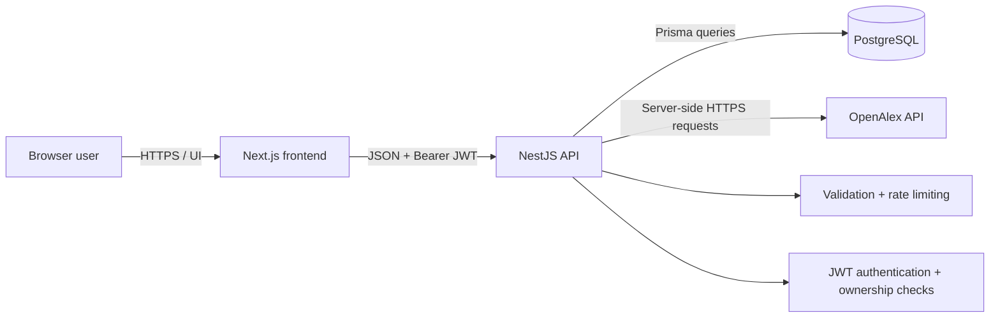
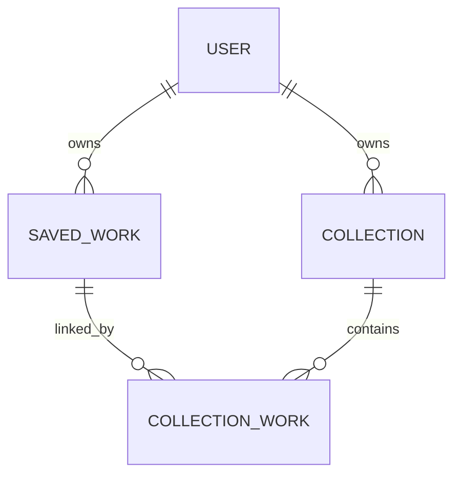

# Exam Report — Introduction to Web Development

## Submission metadata

- **Title:** ResearchTrail — Academic Discovery and Personal Research Library
- **Student ID number:** TODO — student must complete
- **Deployment URL:** TODO — student must complete after deployment
- **Estimated total development time:** TODO — student must complete
- **GitLab repository URL (optional):** TODO — student must complete if submitted by repository

## Submission checklist

- [ ] Metadata above completed by the student.
- [x] Privacy information integrated at `/privacy` and linked globally.
- [x] Accessibility statement integrated at `/accessibility` and linked globally.
- [x] [University of Göttingen legal notice](https://www.uni-goettingen.de/de/439238.html) linked globally and from both statements.
- [x] `README.md` contains system dependencies, local dependency installation, database migration, development, build and production-run instructions.
- [ ] Source submission completed: grant `lorenz.glissmann@uni-goettingen.de` access to the repository stated above, or attach a `.zip` file.
- [ ] Replace the operator/contact placeholders in the privacy and accessibility pages before public deployment.

## Abstract

ResearchTrail is a full-stack web application for students, researchers and other readers who need to discover and organise scholarly literature. It uses OpenAlex metadata to support keyword and topic search, publication filtering, detail inspection, trend analysis and one-hop citation exploration. Users can browse without an account. Registered users additionally maintain a private library, assign reading states, write notes and group publications into collections. The project addresses the common problem of moving from a broad research question to a manageable reading trail without attempting to replace specialist reference managers or bibliometric analysis software. Its scope deliberately prioritises a clear end-to-end architecture, usable research workflows, protected user-specific data and transparent limitations over speculative recommendation or PDF-processing features. ResearchTrail is suitable as an educational demonstrator; a public deployment still requires the named operator, hosting and retention details identified in its privacy notice.

## Range of functions

- Search OpenAlex works by title, topic, author terms or DOI-like input.
- Filter by publication year and open-access status; sort by relevance, date or citation count.
- Browse paginated normalised publication results.
- Inspect publication metadata, reconstructed abstracts, authors, topics, sources and related works.
- Explore a bounded citation/reference graph with a non-graphical publication list alternative.
- Analyse topic publication growth, citation activity, influential authors, related topics and landmark works.
- Register and sign in with a password-protected account.
- Save and remove works, edit notes and reading status, and organise works into collections.
- Erase an account and its stored data through the privacy page.
- Access integrated privacy and accessibility statements and the university legal notice from every view.

## Architecture

### Software stack

| Layer | Technology | Responsibility |
| --- | --- | --- |
| Browser UI | Next.js 16 App Router, React 19, TypeScript, Tailwind CSS 4 | Views, navigation, forms, visualisation and server-state rendering |
| Client data | TanStack Query | Loading/error state, caching, mutations and invalidation |
| Graph | Cytoscape.js | Interactive citation graph rendering |
| HTTP API | NestJS 11, TypeScript, class-validator, Passport JWT | Routes, validation, authentication, authorisation and orchestration |
| Persistence | PostgreSQL 16, Prisma ORM 7 | Account, saved-work, note, status and collection storage |
| External data | OpenAlex REST API | Scholarly works, topics, authors, citations and references |

### System structure

The application is a modular client–server system. Next.js owns presentation and interactions; NestJS is the only trust boundary for validation and data access; Prisma encapsulates persistence; `OpenAlexService` is an anti-corruption/adapter layer that hides external response shapes from the rest of the app.

### Project-wide decisions

1. **OpenAlex access is backend-only.** This keeps the API key outside browser bundles, centralises timeouts/error translation and gives the frontend one stable normalised model.
2. **A bounded graph is used.** Eight references and eight citing works make load time and visual complexity predictable. It is an exploratory aid, not a complete bibliometric graph.
3. **Server state is distinct from component state.** TanStack Query handles asynchronous remote data; local React state handles form drafts and visual interactions. This avoids duplicated loading/cache logic.
4. **Relational ownership is explicit.** Every saved work and collection has a `userId`; every protected mutation verifies ownership. Cascading relations make account erasure complete at the application database level.
5. **Styling uses two levels.** Base and reusable component rules live in separate CSS files; page-specific composition uses colocated Tailwind utilities. This provides consistent focus/controls without building a premature component framework.
6. **Scope is deliberately constrained.** Recommendations, PDF analysis, collaboration, background jobs and Redis were excluded so the implemented research workflow remains correct and maintainable within a semester project.

This stack is suitable because TypeScript spans both services, NestJS provides a clear module/security boundary, PostgreSQL models user ownership and many-to-many collections reliably, and Next.js/React support the dynamic filters and graphs required by the idea. The trade-off is two deployable processes and more configuration than a purely server-rendered monolith.

## Frontend

### Structure and responsibilities

- `app/`: route-level views, metadata and layouts.
- `components/`: shared header, footer, authentication provider, query provider, publication card and privacy controls.
- `lib/`: HTTP client and shared frontend response types.
- `styles/base.css`: document defaults, keyboard focus and reduced-motion behavior.
- `styles/components.css`: reusable buttons, inputs, cards, panels, navigation and legal-document typography.

The frontend validates basic form constraints, builds query parameters, renders loading/error/empty states, stores the current JWT/profile locally, performs authenticated mutations and visualises normalised API responses. Security-sensitive validation and ownership checks are repeated authoritatively on the API.

### Views and interaction options

| View | Main interactions |
| --- | --- |
| Discovery `/` | Search, year/open-access filters, sort, paginate, open/save a result |
| Trends `/trends` | Topic autocomplete, preset/custom range, switch charts and pivot topic |
| Publication `/works/:id` | Read metadata/abstract, follow source/PDF, open graph or related work |
| Citation explorer `/graph/:id` | Select graph nodes or use the keyboard-accessible publication list |
| Library `/library` | Create collections, edit notes/status, assign or remove saved works |
| Login/register | Authenticate or create an account |
| Privacy/accessibility | Read notices, erase an account, follow the legal notice |

Next.js generates the HTML through React Server and Client Components. Data-heavy interactive views are Client Components because they require query state and browser events. Tailwind utilities and the separated CSS layers implement responsive styling without a runtime CSS-in-JS dependency.

### Frontend challenges

- OpenAlex abstracts are not plain strings, so reconstruction is done centrally before display.
- Dense scholarly metadata must remain scannable on narrow screens and at zoom.
- Citation and trend visualisations require both visual clarity and meaningful alternatives for non-pointer/non-visual use.
- Topic autocomplete needs independent draft and committed query state to avoid refetching the complete dashboard on every keystroke.

## Backend

### Structure and responsibilities

- `AuthModule`: registration, password verification, JWT creation and account data controls.
- `WorksModule`: discovery, work detail, related work and graph endpoints.
- `TrendsModule`: topic lookup and trend analytics endpoints.
- `LibraryModule`: protected saved-work and collection operations with ownership checks.
- `OpenAlexModule`: external HTTP adapter, normalisation, timeouts and fallback behavior.
- `PrismaModule`: database connection lifecycle.
- `common/`: JWT guard and typed current-user decorator.

Global request validation strips or rejects unexpected fields and converts supported query primitives. Global throttling limits a client to 60 requests per minute. CORS is restricted to configured/local frontend origins.

### Communication interfaces and APIs

All endpoints use JSON below the `/api` prefix. `400` denotes invalid input, `401` invalid/missing authentication, `404` a missing or non-owned resource, `409` a uniqueness conflict and `502` an OpenAlex failure.

| Method | Route | Protection | Purpose |
| --- | --- | --- | --- |
| POST | `/auth/register` | Public | Create account and JWT session |
| POST | `/auth/login` | Public | Verify credentials and return session |
| DELETE | `/auth/account` | JWT | Erase the account and dependent records |
| GET | `/search` | Public | Search works with filters, sorting and pagination |
| GET | `/works/:id` | Public | Normalised work and up to six related works |
| GET | `/works/:id/graph` | Public | Centre work, up to eight references and eight citations |
| GET | `/trends` | Public | Topic metrics for a supplied range |
| GET | `/trends/topics` | Public | Topic autocomplete results |
| GET | `/trends/topic/:id` | Public | One normalised topic |
| GET/POST | `/library` | JWT | List or save works |
| PATCH/DELETE | `/library/:id` | JWT + owner | Edit or remove a saved work |
| GET/POST | `/collections` | JWT | List or create collections |
| DELETE | `/collections/:id` | JWT + owner | Delete a collection |
| POST | `/collections/:id/works` | JWT + owner | Add an owned saved work |
| DELETE | `/collections/:id/works/:savedWorkId` | JWT + owner | Remove a collection link |

The external adapter calls OpenAlex `/works`, `/topics` and `/authors`. It transfers search/topic filters and OpenAlex identifiers; normalised scholarly metadata returns to the browser. The API key stays server-side.

### Authentication and authorisation

Registration is optional for browsing but required for the personal library and account controls. Passwords are hashed with bcrypt cost 12 and never returned. Successful authentication creates a seven-day signed JWT; Passport verifies signature and expiry. Protected controllers derive `userId` from the verified token rather than request input. Service queries include that `userId`, preventing access to another user's records even if an identifier is guessed. A production review should replace browser local-storage tokens with secure, HTTP-only same-site cookies or document and accept the residual XSS exposure.

### Database

- `User`: UUID, unique email, optional name, bcrypt hash and timestamps.
- `SavedWork`: owner, unique owner/OpenAlex pair, cached publication JSON/metadata, status, note and timestamps.
- `Collection`: owner, owner-unique name, optional description and timestamps.
- `CollectionWork`: composite-key join table with cascading foreign keys.

Prisma was chosen for typed queries and explicit migrations; PostgreSQL provides referential integrity, JSON support for external metadata and reliable transactional persistence.

### Backend challenges

- OpenAlex IDs arrive as URLs or short IDs and must be normalised consistently.
- Abstract inverted indexes must be rebuilt in word-position order.
- Citation graph calls combine centre, reference and citing-work requests while deduplicating nodes.
- Trend data combines grouped counts, top works, author statistics and sibling topics; partial optional datasets degrade to empty sections while primary lookup failures stay visible.
- Every user-owned operation must constrain by both resource ID and authenticated owner.

## Accessibility

The target is WCAG 2.2 AA and relevant EN 301 549 requirements. Implemented measures include semantic `main`, `nav`, `section`, heading and form elements; a skip link; visible focus; labelled inputs; autocomplete metadata; current-page navigation; text plus icons; accessible names for icon-only buttons; `role="status"`/`role="alert"`; reduced-motion behavior; improved control and status contrast; responsive layouts; screen-reader data tables for trend charts; and a link list alternative to the citation canvas.

Verification should combine ESLint/build checks, keyboard-only navigation, browser accessibility tooling, 200%/400% zoom, contrast inspection and screen-reader passes with VoiceOver/Safari and NVDA/Firefox. The current limitations are documented in the integrated statement. Most importantly, the graph list does not yet encode all edge relationships, and full assistive-technology/user testing remains outstanding.

## Data protection

Privacy by design is reflected in optional accounts for public browsing, collection only of an email and optional name, bcrypt password hashing, server-side API keys, strict DTO validation, request throttling, user-scoped authorisation, omission of password hashes from responses, no intentional search-history persistence, no analytics/advertising integration and database cascades for erasure. HTTPS is a deployment requirement.

The application database processes account identity, authentication hashes, saved-publication metadata, reading status, free-text notes, collections and timestamps. The browser stores an access token and basic profile. Web/API infrastructure necessarily processes IP addresses and request metadata and may log them. Search terms are proxied to OpenAlex. No special-category data is requested, but users could put it into free-text notes or queries and are warned not to do so.

Self-service functions cover erasure (account deletion) and rectification/erasure of library notes, status and saved items. Data access, portability, account email/name rectification, restriction, objection and questions about host logs require manual contact with the controller. Before deployment the operator must complete controller/contact, host, location, processor, legal-basis, log-retention and supervisory-authority details. The integrated policy deliberately calls out these gaps instead of making unsupported compliance claims.

## Evaluation audit

| Criterion | Status | Evidence / remaining work |
| --- | --- | --- |
| Functional completeness | **Met for declared scope** | Discovery, trends, details, graph, auth and library routes are implemented; excluded features are stated. End-to-end tests with live DB/OpenAlex are still desirable. |
| Correctness | **Mostly met** | DTO validation, ownership constraints, normalisation and error states exist. Automated unit/integration coverage is the largest remaining engineering gap. |
| Appropriateness | **Met** | Stack and bounded semester scope match a data-driven interactive web app. |
| Code quality | **Mostly met** | Strict TypeScript, modules, reusable components/services, separated style layers and lint/build scripts. The large trends view should be split into chart/section components in a later refactor. |
| Architecture | **Met** | Trust boundaries, modules, external adapter, relational model and rationale are documented above. |
| Strategic decisions | **Met** | Six cross-project decisions and their trade-offs are recorded above. |
| Usability | **Mostly met** | Responsive navigation, explicit loading/error/empty states and focused workflows. Formal task-based usability testing remains outstanding. |
| Accessibility | **Mostly met** | Integrated statement and concrete WCAG-oriented improvements. Screen-reader/user testing and richer graph equivalence remain outstanding. |
| Data protection | **Partially met pending deployment details** | Data minimisation, hashing, authorisation, account erasure and policy exist. Data access/portability requires manual handling; replace local-storage JWTs and complete controller/host/retention details before production. |
| Legal submission items | **Partially met** | All three legal links/pages are integrated; student metadata, contact placeholders and repository access remain manual checklist items. |
